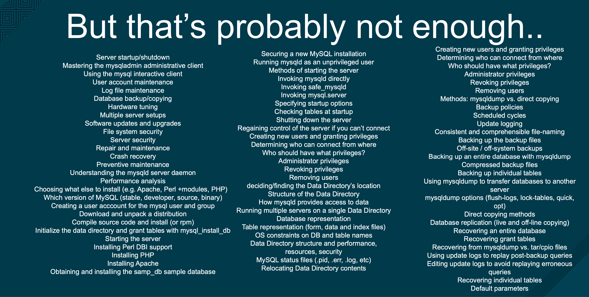
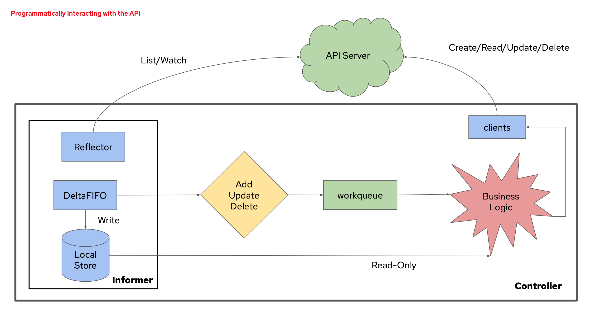
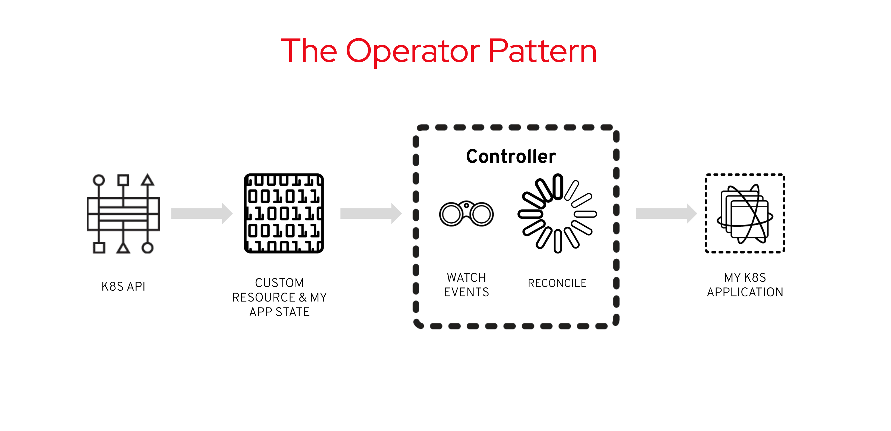

layout: true

.signature[@algogrit]

---

class: center, middle

# Kubernetes Operators

Gaurav Agarwal

---

## Agenda

- Need for K8s Operators
- Understanding the pieces of an Operator
  - Operator vs Controller
- Introduction to the Operator Framework
  - Ansible vs Go
- Using `kubebuilder`

---
class: center, middle

### Need for K8s Operator

---
class: center, middle

Stateless vs Stateful applications

---
class: center, middle

Kubernetes controllers

---
class: center, middle

#### What's the challenge in managing stateful applications?

---
class: center, middle

> installing, scaling, self-heal, clean up, update, backup, restore

---

#### But that's probably not enough

.center[*Take mysql for instance...*]

---
class: center, middle

.content-credits[https://www.youtube.com/watch?v=8_DaCcRMp5I]

---
class: center, middle

### What is an operator?

---
class: center, middle

An **operator** is a controller that encodes human operational knowledge: how do I run and manage a specific piece of complex software.

Operators are software extensions to Kubernetes that make use of [custom resources](https://kubernetes.io/docs/concepts/extend-kubernetes/api-extension/custom-resources/) to manage applications and their components. Operators follow Kubernetes principles, notably the [control loop](https://kubernetes.io/docs/concepts/architecture/controller/).

---
class: center, middle

A kubernetes operator is the name of a pattern that consists of a kubernetes controller that adds new objects to the Kubernetes API, in order to configure and manage an application, such as Prometheus or etcd.

---

It's composed of:

- Resources (Pod, ConfigMap, *Route)
- Controller (ReplicaSet, Deployment, DaemonSet)
- Domain or Application Specific Knowledge (Installing, Scale, Self-Heal, Clean Up, Update, Backup, Restore)

**OpenShift only*

---
class: center, middle

#### Operator vs Controller

.content-credits[https://www.youtube.com/watch?v=KBTXBUVNF2I]

---
class: center, middle

A **controller** is a loop that reads desired state (spec), observed cluster state (others’ status), and external state, and the reconciles cluster state and external state with the desired state, writing any observations down (to our own status).

*All of Kubernetes functions on this model.*

---
class: center, middle

---
class: center, middle

An **operator** is a controller that encodes human operational knowledge: how do I run and manage a specific piece of complex software.

---
class: center, middle

All operators are controllers, but not all controllers are operators.

---
class: center, middle

#### How do operators work?

---
class: center, middle

Control Loop

---
class: center, middle

In robotics and automation, a *control loop* is a non-terminating loop that regulates the state of a system.

---
class: center, middle

In Kubernetes, controllers are control loops that watch the state of your cluster, then make or request changes where needed. Each controller tries to move the current cluster state closer to the desired state.

---
class: center, middle

---

Need to work with K8s API

- Different client libraries in different languages

  *Python, Java, dotnet, JavaScript, Haskell*

---
class: center, middle

`client-go` as well

---
class: center, middle

Require knowledge of informers/shared informers for object cache & event handling

---
class: center, middle

### How do I write an Operator?

---
class: center, middle

#### Operator Framework

.content-credits[https://learn.openshift.com/operatorframework/]

---
class: center, middle

> The Operator Framework is a family of tools and capabilities to deliver on the customer experience described above. It is not just about writing code; testing, delivering, and updating Operators is just as important.

.content-credits[https://docs.openshift.com/container-platform/4.1/applications/operators/olm-what-operators-are.html]

---

The Operator Framework components consist of open source tools to tackle these problems:

- *Operator SDK*
- Operator Lifecycle Manager
- Operator Metering
- OperatorHub

---
class: center, middle

##### Operator SDK

---
class: center, middle

Assists Operator authors in bootstrapping, building, testing, and packaging their own Operator based on their expertise without requiring knowledge of Kubernetes API complexities.

> operator-sdk is part of operator-framework, part of CNCF landscape (https://landscape.cncf.io/selected=operator-framework), owners are from redhat, most commits from redhat.

---

Supports writing operator with:

- Helm
- Ansible &

---
class: center, middle

Go

---
class: center, middle

.content-credits[https://operatorframework.io/operator-capabilities/]

---
class: center, middle

*Hands-on*: Writing an [Operator SDK in Go](https://learn.openshift.com/operatorframework/go-operator-podset/)

---
class: center, middle

#### [Kubebuilder](https://github.com/kubernetes-sigs/kubebuilder)

---
class: center, middle

Kubebuilder is a set of tooling and opinions about how to structure custom controllers & operators.

---

Built on top of:

- `controller-runtime`: which contains libraries for building the controller part of your operator

- `controller-tools`: contains tools for generating CRDs, etc for your operator

---
class: center, middle

> `kubebuilder` is one of the kubernetes-sigs (Special Interest Groups), part of the API Machinery group, both owners are from google, most commits from google, redhat.

---

##### Operator SDK vs `Kubebuilder`

- Operator SDK also has support for Ansible and Helm operators, which make it easy to write operators without having to learn Go and if you already have experience with Ansible or Helm

- Operator SDK includes integrations with the Operator Lifecycle Manager (OLM), which is a key component of the Operator Framework that is important to Day 2 cluster operations, like managing a live upgrade of your operator.

- Operator SDK includes a scorecard subcommand that helps you understand if your operator follows best practices.

- Operator SDK includes an e2e testing framework that simplifies testing your operator against an actual cluster.

.content-credits[https://github.com/operator-framework/operator-sdk/issues/1758]

---

##### Operator SDK vs `Kubebuilder` (continued)

- Kubebuilder includes an envtest package that allows operator developers to run simple tests with a standalone etcd and apiserver.

- Kubebuilder scaffolds a Makefile to assist users in operator tasks (build, test, run, code generation, etc.); Operator SDK is currently using built-in subcommands. Each has pros and cons. The SDK team will likely be migrating to a Makefile-based approach in the future.

- Kubebuilder uses Kustomize to build deployment manifests; Operator SDK uses static files with placeholders.

- Kubebuilder has recently improved its support for admission and CRD conversion webhooks, which has not yet made it into SDK.

.content-credits[https://github.com/operator-framework/operator-sdk/issues/1758]

---
class: center, middle

The SDK and Kubebuilder teams work closely together, and we're planning to increase our efforts to help the `kubebuilder` team maintain `controller-tools` and `controller-runtime` so that the entire community has access to the latest features and bug fixes.

---
class: center, middle

*Tutorial*: [Building CronJob](https://book.kubebuilder.io/cronjob-tutorial/cronjob-tutorial.html)

---

class: center, middle

Code
https://github.com/algogrit/presentation-kubernetes-operators

Slides
https://kubernetes-operators.slides.algogrit.com
